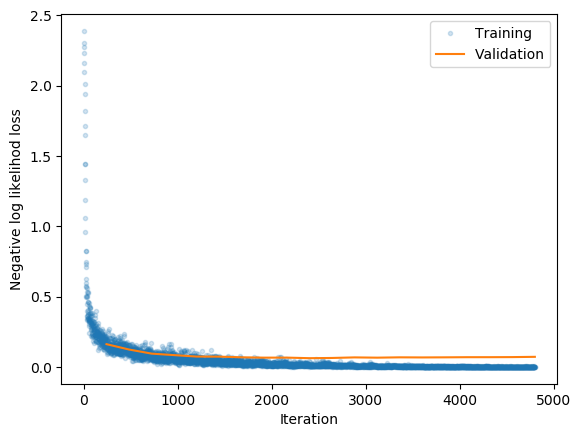
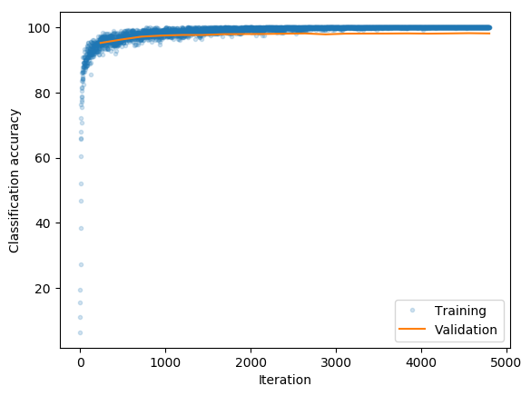
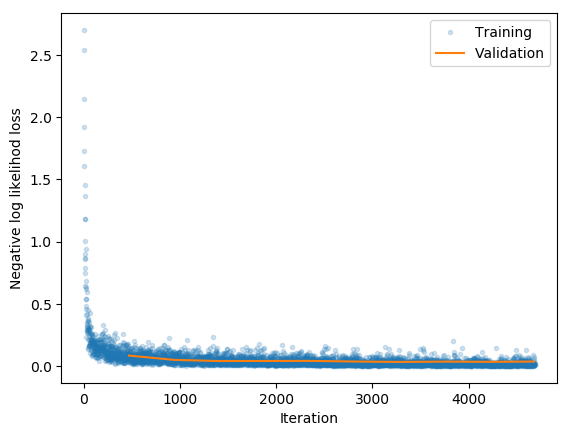
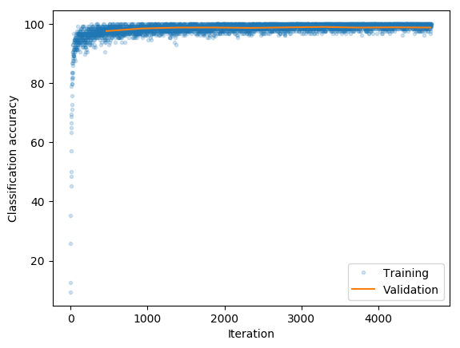

# nn
## Implementation of neural network modules in numpy
This is an implementation of some common neural network architectural modules using the Numerical Python (Numpy) library.

The overall modular structure is inspired by that of [PyTorch](https://pytorch.org/). All network modules are children of a parent [Module](https://pytorch.org/docs/stable/_modules/torch/nn/modules/module.html#Module). Both layers, such as linear, convolutional, and recurrent, and nonlinear activation functions are implemented as subclasses of the Module class. Network models are also instantiated as subclasses of the `Module` class and hold their layers and activation functions as attributes, effectively forming a graph.

Conversely to PyTorch, the backwards and forward pass of any module is explicitly coded in Python using NumPy rather than in a C backend. This is obviously not competitive on performance, but served as nice personal exercises in deriving and implementing backpropagation for a range of different network layers. All code there executes exclusively on the CPU.

## Implemented modules
Currently implemented modules are
- Linear layers
    - [Linear](https://pytorch.org/docs/stable/nn.html#linear)
- Dropout layers
    - [Dropout1D](https://pytorch.org/docs/stable/nn.html#dropout)
- Normalization layers
    - [BatchNorm1D](https://pytorch.org/docs/stable/nn.html#batchnorm1d)
- Convolutional layers
    - [2 dimensional convolution](https://pytorch.org/docs/stable/_modules/torch/nn/modules/conv.html#Conv2d)
- Pooling layers
    - [2 dimensional max pooling](https://pytorch.org/docs/stable/nn.html#maxpool1d)
    - [2 dimensional average pooling](https://pytorch.org/docs/stable/nn.html#avgpool1d)
- Activations
    - [Sigmoid](https://pytorch.org/docs/stable/nn.html#sigmoid)
    - [Tanh](https://pytorch.org/docs/stable/nn.html#tanh)
    - [ReLU](https://pytorch.org/docs/stable/nn.html#relu)
    - [Softplus](https://pytorch.org/docs/stable/nn.html#softplus)
    - [Softmax](https://pytorch.org/docs/stable/nn.html#softmax)
- Losses
    - [Mean squared loss (MSE)](https://pytorch.org/docs/stable/nn.html#mseloss)
    - [Categorical cross entropy loss (CCEL)](https://pytorch.org/docs/stable/nn.html#crossentropyloss)

## Implementation roadmap
Layers on the roadmap for implementation are
- Convolutional layers
    - [1 dimensional convolution](https://pytorch.org/docs/stable/_modules/torch/nn/modules/conv.html#Conv1d)
    - [3 dimensional convolution](https://pytorch.org/docs/stable/_modules/torch/nn/modules/conv.html#Conv3d)
- Pooling layers
    - [1 dimensional max pooling](https://pytorch.org/docs/stable/nn.html#maxpool1d)
    - [1 dimensional average pooling](https://pytorch.org/docs/stable/nn.html#avgpool1d)
    - [3 dimensional max pooling](https://pytorch.org/docs/stable/nn.html#maxpool1d)
    - [3 dimensional average pooling](https://pytorch.org/docs/stable/nn.html#avgpool1d)
- Dropout layers
    - [2 dimensional dropout](https://pytorch.org/docs/stable/_modules/torch/nn/modules/dropout.html#Dropout2d)
    - [3 dimensional dropout](https://pytorch.org/docs/stable/_modules/torch/nn/modules/dropout.html#Dropout3d)
- Recurrent layers
    - [RNN](https://pytorch.org/docs/stable/nn.html#rnn)
    - [LSTM](https://pytorch.org/docs/stable/nn.html#lstm)
    - [GRU](https://pytorch.org/docs/stable/nn.html#gru)


## How to construct a network model
A network model can be defined as a class. 

In the `__init__` method, the network should have its layers and activation functions etc. added either as either named attributes or using the `add_module` method. The latter option is well suited in cases where many similar layers are added sequentially. 

The class should have the required `forward` and `backward` methods that define the forward and backward propagations using the `forward` and `backward` methods of the models modules. When the models are sequential, a simple for loop is easy to use.


### FNN example
Below is an example of how to construct an FNN classifier. The classifier has
- variable input and output dimensions
- variable number of hidden layers and dimensions
- specifiable activation function
- potential batchnorm and dropout layers
```python
class FNNClassifier(nn.Module):
    def __init__(self, in_features, out_classes, hidden_dims=[256, 128, 64], activation=nn.ReLU, batchnorm=False, dropout=False):
        super(FNNClassifier, self).__init__()
        dims = [in_features, *hidden_dims, out_classes]
        for i in range(len(dims) - 1):
            is_output_layer = i == len(dims) - 2
            self.add_module("Linear" + str(i), nn.Linear(dims[i], dims[i+1]))
            if batchnorm and not is_output_layer:
                self.add_module("BatchNorm" + str(i), nn.BatchNorm1D(dims[i+1]))
            if dropout and not is_output_layer:
                self.add_module("Dropout" + str(i), nn.Dropout(p=dropout))
            if not is_output_layer:
                self.add_module("Activation" + str(i), activation())
            else:
                self.add_module("Activation" + str(i), nn.Softmax())

    def forward(self, x):
        x = x.reshape(x.shape[0], -1)
        for module in self._modules.values():
            x = module.forward(x)
        return x

    def backward(self, dout):
        for module in reversed(self._modules.values()):
            dout = module.backward(dout)
``` 

### CNN example
Below is an example of how to construct an CNN classifier. The classifier has
- variable input and output dimensions
- variable number of hidden layers and dimensions
- specifiable activation function
- potential batchnorm and dropout layers
For this classifier however, changing the convolutional layers require a corresponding change to the fully connected classifier layers. Alternatively, a completely convolutional model could be created.
```python
class CNNClassifier(nn.Module):
    def __init__(self, in_features, out_classes, feature_maps=[16, 32], hidden_dims=[512], activation=nn.ReLU, batchnorm=False, dropout=False):
        super(CNNClassifier, self).__init__()
        # Convolutional layers
        self.add_module("Convolutional0", nn.Conv2D(1, feature_maps[0], kernel_size=(5, 5)))
        self.add_module("Maxpool0", nn.MaxPool2D(kernel_size=(2, 2), stride=2, padding=0))
        self.add_module("Activation0", activation())
        self.add_module("Convolutional1", nn.Conv2D(feature_maps[0], feature_maps[1], kernel_size=(5, 5)))
        self.add_module("Maxpool1", nn.MaxPool2D(kernel_size=(2, 2), stride=2, padding=0))
        self.add_module("Activation1", activation())
        self.add_module("Flatten", nn.Flatten())
        # Feedforward classifier
        dims = [*hidden_dims, out_classes]
        for i in range(len(dims) - 1):
            is_output_layer = i == len(dims) - 2
            if batchnorm:
                self.add_module("BatchNorm" + str(i), nn.BatchNorm1D(dims[i]))
            self.add_module("Linear" + str(i), nn.Linear(dims[i], dims[i+1]))
            if dropout and not is_output_layer:
                self.add_module("Dropout" + str(i), nn.Dropout(p=dropout))
            if not is_output_layer:
                self.add_module("Activation" + str(i+2), activation())
            else:
                self.add_module("Activation" + str(i+2), nn.Softmax())

    def forward(self, x):
        for module in self._modules.values():
            x = module.forward(x)
        return x

    def backward(self, dout):
        for module in reversed(self._modules.values()):
            dout = module.backward(dout)
```


## Training example
In /examples, two MNIST examples has been created for testing purposes. 

The above FNN classifier without batchnorm and dropout was overfitted on the training set. The loss and accuracy can be seen below.




The convolutional classifier from above has also been tested. The convolutional architecture is much less prone to overfitting.




## Sources
- Some inspiration has been found at the DTU PhD Deep Learning Summer School 2015, see [website](http://deeplearningdtu.github.io/Summerschool_2015/) and [github repository](https://github.com/DeepLearningDTU/Summerschool_2015/).
- The batch normalization layer has been inspired by https://github.com/martinkersner/cs231n/blob/master/assignment2/layers.py)
- The convolutional layer has been inspired by https://wiseodd.github.io/techblog/2016/07/16/convnet-conv-layer/
- The recurrent LSTM unit has been inspired by http://blog.varunajayasiri.com/numpy_lstm.html
- See also https://github.com/wiseodd/hipsternet and https://github.com/cs231n/cs231n.github.io